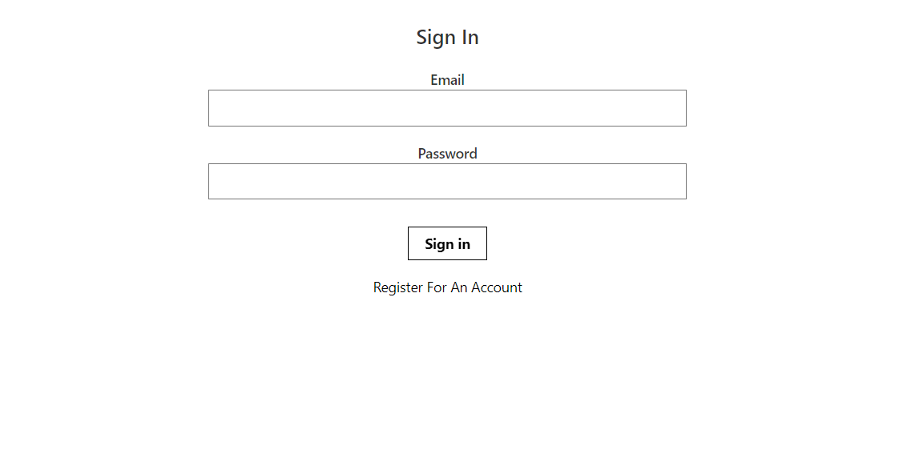
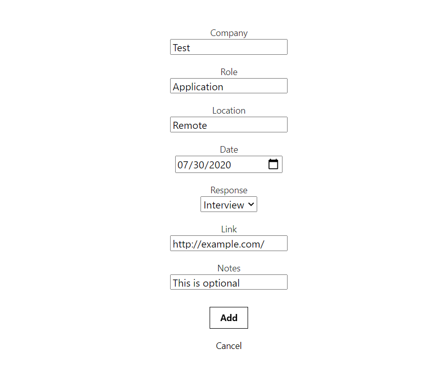
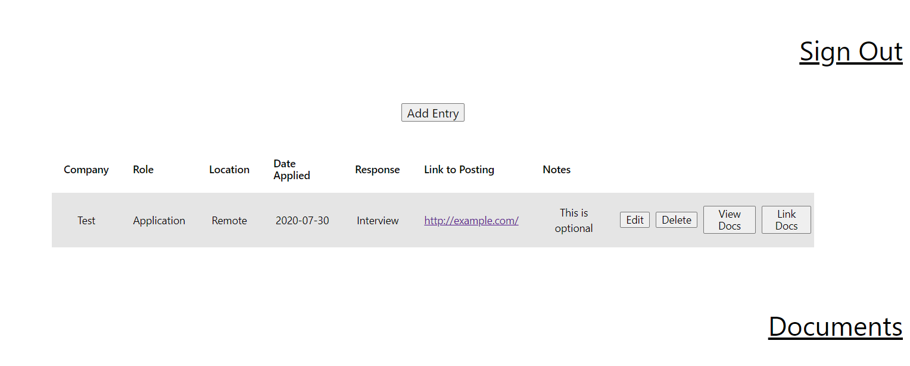
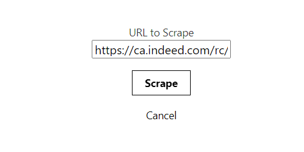
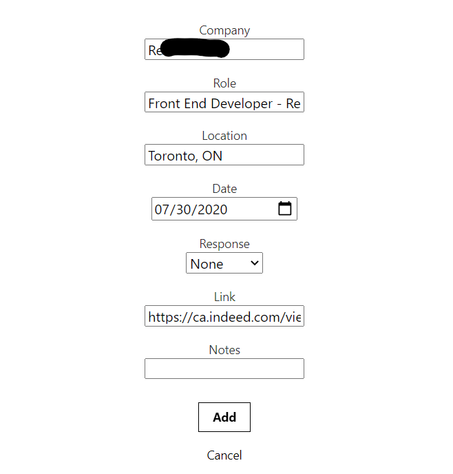
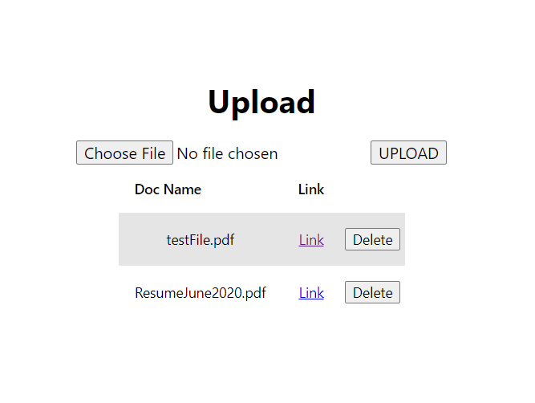
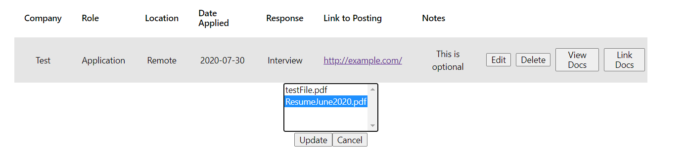
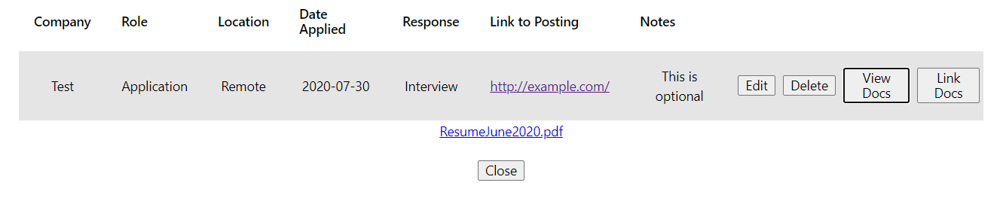

# Application_Tracker

Front End of a Web Application that helps you keep track of your job applications and relevant documents for each application. Uses React and TypeScript on the front end.

# Features:

* Secure Signin/Register
  
* Add, Modify, Remove applications to your list of applications

  
* Indeed scraping to ease addition of applications  

  
* File Storage of documents(Resume, Cover Letter) using AWS S3
  
* Linking of documents to specific applications

# Upcoming:

* Maps integration to show distances to job locations